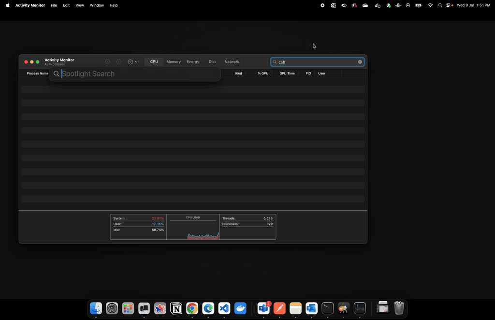

# Owl Coffee

Owl Coffee is a simple, fast, and easy-to-use app to keep your mac awake. 🥱

<div align="center" width="100%">
     
</div>

Built with [Swift](https://developer.apple.com/swift/) it taps into the high-level commands supported by the mac operating system to prevent it from going to sleep, with an option to keep the display awake.

All with the convinence of system tray options.

## Application Demo



## Installation

To install Owl Coffee, you can download the latest release from the [releases page](https://github.com/KiritoCyanPine/owl-coffee/releases).

You can also build the app from source by following the instructions in the [Building and Running](#building-and-running) section.

## Features

- **Prevents sleep:** Stops your Mac from entering sleep mode
- **Prevents display sleep:** Keeps the screen from turning off
- **Prevents disk sleep:** Keeps hard drives spinning
- **Prevents system idle sleep:** Maintains system activity

OwlCoffee utilised caffeinate to achieve these features.

## Building and Running

To build and run Owl Coffee from source, you may need to install [Xcode](https://developer.apple.com/xcode/) and the [Swift Package Manager](https://swift.org/package-manager/).

Swift Package Manager is optional, as the project is self-contained. If you have Xcode installed, you can open the project directly.

```bash
git clone https://github.com/KiritoCyanPine/owl-coffee-native.git
```

After cloning the repository, you can open the project in Xcode:

```bash
cd owl-coffee-native
open OwlCoffee.xcodeproj
```

Once the project is open in Xcode, you can build and run the app by selecting the target and clicking the "Run" button.

To build it as an executable, you can use the make command:

```bash
make build
```
